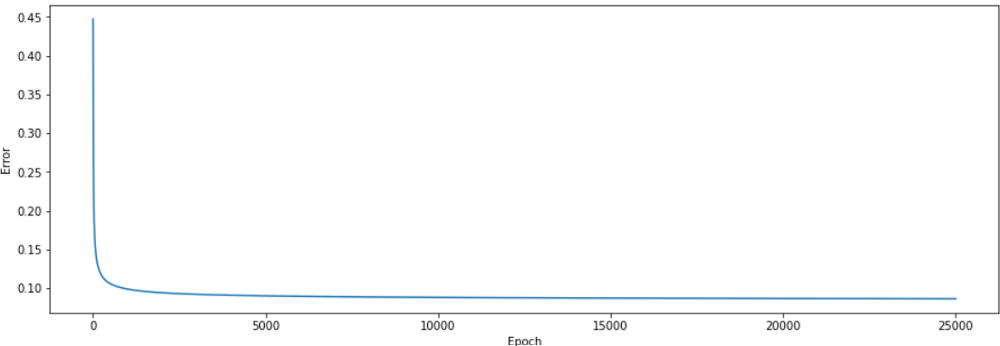

# Exploratory-Data-Analysis-&-Deep-learning

1. Explotary Data Analysis

Exploratory Data Analysis was used to describte the data, clean the data, create data frame for numerical features. It also can determine strongly correlated features,
visualize feature and quantitative relationship. The train.csv file was used for us to learn how to manage the data and construct data visualization with diverse chart like line, bar, histogram and others.

2. Neural network

Neural network was under deep learning, machine learning and artificial intelligient. 

